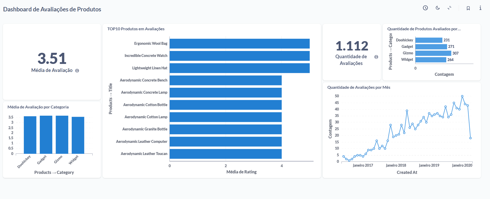

# 📊 Dashboard Analítico de Avaliações de Produtos — Metabase (Escola DNC)
### Projeto de Análise de Dados utilizando Metabase + Dataset da DNC

---

## 📝 Descrição do Projeto

Este projeto apresenta uma **análise exploratória e visual das avaliações de produtos**, desenvolvida a partir de dados disponibilizados pela Escola DNC, utilizando a ferramenta Metabase.
O objetivo é gerar insights sobre a **percepção dos usuários, desempenho dos produtos, categorias mais bem avaliadas e a evolução do volume de avaliações ao longo do tempo**.

---

## 🎯 Objetivo do Projeto

- Analisar a média geral de avaliações dos produtos
- Identificar os produtos com melhor desempenho em avaliações
- Comparar a média de avaliação entre categorias
- Avaliar o volume de avaliações ao longo do tempo

---

## 🗂️ Fonte dos Dados

Os dados utilizados neste projeto foram extraídos do **Metabase**, a partir de datasets disponibilizados para fins educacionais pela **DNC**.

🔗 Ambiente de dados:
https://dex.dnc.group/browse

📄 **Tabelas analisadas:** `Reviews` + `Products`

### Principais campos utilizados:

**Products**
- `Product ID` – Identificador do produto
- `Title` – Nome do produto
- `Category` – Categoria do produto

**Reviews**

- `Product ID` – Identificador do produto
- `Rating` – Nota da avaliação
- `Created At` – Data da avaliação

🔗 **Integração dos Dados**

 - A integração entre as tabelas Products e Reviews foi realizada diretamente no Metabase, por meio da configuração de relacionamentos no Data Model, sem utilização de código SQL.

**Esse relacionamento permitiu:**

- Associar avaliações aos respectivos produtos
- Agrupar métricas por produto e categoria
- Calcular médias e contagens automaticamente
- Criar análises temporais com base na data das avaliações
---

## 📌 Principais KPIs

- ⭐ **Média Geral de Avaliação:** `3.51`
- 📝 **Total de Avaliações:** `1.112`
- ⭐  **Média de Avaliação por Categoria**
- 🏆 **Top 10 Produtos por Média de Avaliação**
- 📦 **Quantidade de Produtos Avaliados por Categoria**
- 📅 **Volume de Avaliações por Mês**

---

## 📈 Análises Realizadas

### 1️⃣ Média Geral de Avaliações
- A média geral das avaliações é 3.51
- Indica uma percepção moderadamente positiva dos usuários

## 2️⃣ Top 10 Produtos Mais Bem Avaliados
- Produtos como Ergonomic Wool Bag e Incredible Concrete Watch apresentam médias elevadas
- Sugere boa aceitação desses itens pelos usuários

## 3️⃣ Média de Avaliação por Categoria
-As categorias apresentam médias semelhantes
- Não há grandes discrepâncias entre os grupos analisados

## 4️⃣ Evolução do Volume de Avaliações
- Crescimento gradual do número de avaliações ao longo do tempo
- Indica aumento de engajamento dos usuários na plataforma

---

## 🔍 Insights Estratégicos

- 📌 A percepção geral dos produtos é positiva, com avaliações acima da média
- 📌 Algumas categorias concentram maior volume de avaliações
- 📌 O aumento contínuo de avaliações sugere crescimento da base de usuários ou maior engajamento

---

## 🚀 Próximo passo:

Replicar a análise utilizando SQL para aprofundamento técnico

---

## 🛠️ Ferramentas Utilizadas

- **Metabase** – Modelagem dos dados, relacionamentos e visualizações
- **Excel** – Organização e exploração inicial dos dados
- **GitHub** – Versionamento e documentação do projeto

---

## 🖼️ Dashboard de Avaliações de Produtos

---

✨ *Projeto desenvolvido para fins educacionais e portfólio em Análise de Dados.*